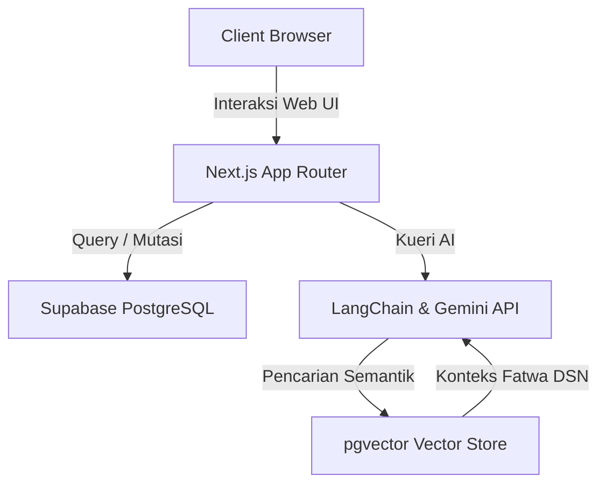

# ARCHITECTURE & DATABASE SCHEMA

Dokumen ini mendefinisikan arsitektur sistem tingkat tinggi, skema database relasional (Supabase PostgreSQL), Chart of Accounts (COA) akuntansi, dan alur integrasi AI RAG untuk **IQ-RA System (Koperasi Syariah Digital)**.

---

## 1. Arsitektur Komponen Utama

IQ-RA System mengadopsi paradigma arsitektur modular terintegrasi:
* **Frontend-Backend Engine (Next.js + Server Actions)**: Melakukan rendering UI reaktif premium dan eksekusi server logic secara aman.
* **Database & Ledger Engine (Supabase)**: Bertanggung jawab atas penyimpanan data relasional dan database vektor (`pgvector`).
* **AI RAG Pipeline**: Mengambil konteks regulasi Fatwa DSN-MUI dari data vektor dan menghasilkan respon cerdas melalui Google Gemini API.

---

## 2. Skema Database Relasional (Supabase PostgreSQL)

Berikut adalah struktur tabel inti yang digunakan untuk mendukung seluruh fungsionalitas Koperasi Syariah Digital:

### 2.1. Tabel `users`
Menyimpan kredensial otentikasi utama dan penentuan hak akses (*Role-Based Access Control*).
* `id` (UUID, Primary Key)
* `email` (VARCHAR, Unique)
* `password_hash` (VARCHAR)
* `role` (VARCHAR) — `jamaah` (member), `takmir` (maker admin), `dps` (checker board), `admin`
* `created_at` (TIMESTAMP)

### 2.2. Tabel `members`
Menyimpan profil detail anggota koperasi yang terhubung dengan data autentikasi dan status verifikasi KYC.
* `id` (UUID, Primary Key)
* `user_id` (UUID, Foreign Key ke `users.id`)
* `full_name` (VARCHAR)
* `nik` (VARCHAR, Unique) — Nomor Induk Kependudukan
* `address` (TEXT)
* `phone` (VARCHAR)
* `status` (VARCHAR) — `pending` (menunggu verifikasi), `verified` (terverifikasi), `rejected`
* `created_at` (TIMESTAMP)

### 2.3. Tabel `accounts`
Menampung saldo simpanan anggota untuk setiap kategori simpanan syariah.
* `id` (UUID, Primary Key)
* `member_id` (UUID, Foreign Key ke `members.id`)
* `account_type` (VARCHAR) — `pokok` (syirkah awal), `wajib` (syirkah bulanan), `wadiah` (titipan), `mudharabah` (investasi bagi hasil)
* `balance` (NUMERIC)
* `created_at` (TIMESTAMP)

### 2.4. Tabel `transactions`
Mencatat histori transaksi setoran atau penarikan kas simpanan anggota.
* `id` (UUID, Primary Key)
* `account_id` (UUID, Foreign Key ke `accounts.id`)
* `transaction_type` (VARCHAR) — `deposit` (setoran), `withdrawal` (penarikan)
* `amount` (NUMERIC)
* `reference_number` (VARCHAR)
* `created_at` (TIMESTAMP)

### 2.5. Tabel `financing_contracts`
Mencatat detail akad pembiayaan yang diajukan atau disetujui untuk anggota.
* `id` (UUID, Primary Key)
* `member_id` (UUID, Foreign Key ke `members.id`)
* `contract_type` (VARCHAR) — `murabahah` (jual beli), `qard` (benevolent/kebajikan)
* `principal_amount` (NUMERIC) — Harga beli barang / Pokok pinjaman
* `margin_amount` (NUMERIC) — Keuntungan koperasi (0 untuk Qardhul Hasan)
* `installment_period` (INTEGER) — Jumlah bulan tenor angsuran
* `remaining_balance` (NUMERIC) — Sisa tagihan
* `status` (VARCHAR) — `draft`, `verified_by_takmir`, `approved_by_dps`, `active`, `paid_off`, `rejected`
* `created_at` (TIMESTAMP)

### 2.6. Tabel `journal_entries`
Buku besar ledger ganda (*double-entry journal*) otomatis untuk pencatatan transaksi berbasis standar akuntansi SAK EP.
* `id` (UUID, Primary Key)
* `transaction_id` (UUID, Nullable, referensi ke `transactions.id` atau `financing_contracts.id`)
* `code_coa` (VARCHAR) — Kode Akun / Chart of Accounts
* `debit` (NUMERIC)
* `credit` (NUMERIC)
* `description` (TEXT)
* `created_at` (TIMESTAMP)

---

## 3. Chart of Accounts (COA) Akuntansi Koperasi (SAK EP)

Sistem menggunakan Chart of Accounts (COA) standar berikut untuk menjamin keabsahan laporan keuangan Neraca, PHU, dan Arus Kas:

| Kode COA | Nama Akun | Kategori Akun | Saldo Normal |
| :--- | :--- | :--- | :--- |
| **101** | Kas & Setara Kas | Aset (Aktiva) | Debit |
| **102** | Piutang Pembiayaan Murabahah | Aset (Aktiva) | Debit |
| **201** | Liabilitas Simpanan Wadiah | Liabilitas (Pasiva) | Kredit |
| **202** | Liabilitas Simpanan Mudharabah | Liabilitas (Pasiva) | Kredit |
| **301** | Modal Anggota (Pokok & Wajib) | Ekuitas (Pasiva) | Kredit |
| **401** | Pendapatan Margin Murabahah | Pendapatan | Kredit |
| **501** | Beban Operasional | Beban (Biaya) | Debit |

---

## 4. Aliran Jurnal Transaksi Otomatis (Double-entry Rules)

Setiap aksi keuangan dalam sistem memicu pencatatan jurnal ganda otomatis dengan prinsip penyeimbangan (balance):

### 4.1. Anggota Menyetor Simpanan Wadiah (Rp 1.000.000)
* **Debit**: `101 - Kas` (Rp 1.000.000)
* **Kredit**: `201 - Liabilitas Simpanan Wadiah` (Rp 1.000.000)

### 4.2. Pencairan Pembiayaan Murabahah Disetujui (Tenor 10 Bulan)
*Koperasi membelikan laptop seharga Rp 10.000.000 dengan margin yang disepakati Rp 2.000.000 (Total tagihan piutang Rp 12.000.000)*
* **Debit**: `102 - Piutang Pembiayaan Murabahah` (Rp 12.000.000)
* **Kredit**: `101 - Kas` (Rp 10.000.000)
* **Kredit**: `401 - Pendapatan Margin Murabahah` (Rp 2.000.000) *(Dicatat sebagai margin yang ditangguhkan/direalisasi)*

### 4.3. Anggota Membayar Angsuran Murabahah Bulanan (Rp 1.200.000)
*Angsuran terdiri dari porsi pokok Rp 1.000.000 dan porsi margin Rp 200.000*
* **Debit**: `101 - Kas` (Rp 1.200.000)
* **Kredit**: `102 - Piutang Pembiayaan Murabahah` (Rp 1.200.000)

### 4.4. Pembayaran Beban Operasional (Rp 500.000)
* **Debit**: `501 - Beban Operasional` (Rp 500.000)
* **Kredit**: `101 - Kas` (Rp 500.000)

---

## 5. Aliran AI RAG (Retrieval-Augmented Generation)

Pipeline RAG dirancang untuk menjamin chatbot asisten syariah memberikan jawaban valid berdasarkan Fatwa DSN-MUI:

1. **Ingestion & Embedding**:
   - Dokumen Fatwa DSN-MUI dipotong menjadi beberapa bagian (*chunking*).
   - Setiap bagian dikonversi menjadi representasi vektor numerik berdimensi tinggi menggunakan model embedding.
   - Hasil embedding disimpan ke tabel `sharia_knowledge` di PostgreSQL menggunakan ekstensi `pgvector`.
2. **Retrieval**:
   - Pengguna mengirimkan pertanyaan (misal: *"Bagaimana ketentuan denda pada akad Murabahah?"*).
   - Sistem melakukan embedding terhadap pertanyaan tersebut, lalu melakukan pencarian kecocokan kemiripan kosinus (*cosine similarity*) ke tabel `sharia_knowledge`.
3. **Generation**:
   - Fragmen teks fatwa yang paling relevan (misal Fatwa No. 17 tentang Sanksi Atas Nasabah Mampu yang Menunda Pembayaran) diambil dari database.
   - Fragmen tersebut digabungkan bersama pertanyaan pengguna sebagai *context prompt*.
   - Prompt dikirim ke Google Gemini API yang kemudian menyintesis jawaban yang akurat, informatif, dan secara eksplisit merujuk pada nomor Fatwa DSN-MUI terkait.
