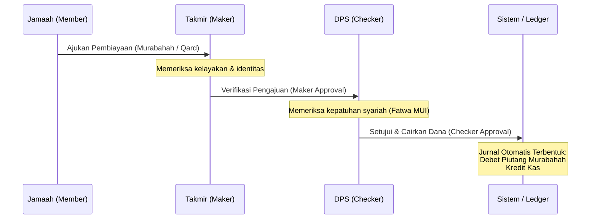

# BUSINESS RULES & OPERATIONAL GUIDELINES

Dokumen ini memuat seluruh aturan bisnis utama, pembatasan hak akses (*Role-Based Access Control*), mekanisme otorisasi ganda (*Four-Eyes Principle*), pembatasan nilai transaksi (*Threshold*), serta logika perhitungan keuangan syariah yang diterapkan dalam **IQ-RA System (Koperasi Syariah Digital)**.

---

## 1. Hak Akses & Peran Pengguna (Role-Based Access Control - RBAC)

Sistem memisahkan akses pengguna ke dalam 4 peran utama demi menjamin pembagian tugas (*segregation of duties*) dan mitigasi risiko operasional:

### 1.1. Peran `jamaah` (Anggota Koperasi)
* Mengunggah data identitas (KTP) untuk proses pengajuan KYC.
* Melihat saldo akun simpanan pokok, wajib, wadiah, dan mudharabah milik pribadi.
* Melakukan penyetoran atau penarikan dana simpanan (simulasi teller).
* Mengajukan pembiayaan baru (akad **Murabahah** atau **Qardhul Hasan**).
* Membayar tagihan angsuran pembiayaan yang aktif.
* Melakukan tanya-jawab dengan Asisten Kepatuhan Syariah AI.

### 1.2. Peran `takmir` (Mosque Admin / Maker)
* Bertindak sebagai verifikator pertama di tingkat masjid.
* Memverifikasi keabsahan profil Jamaah di lingkungannya (menyetujui status KYC).
* Melakukan peninjauan awal (*Maker*) terhadap pengajuan pembiayaan Jamaah.
* Memastikan kelayakan barang kebutuhan pembiayaan Murabahah dan keabsahan dokumen pendukung.
* Menyetujui pengajuan pembiayaan di tingkat pertama untuk diteruskan ke DPS.

### 1.3. Peran `dps` (Dewan Pengawas Syariah / Checker)
* Bertindak sebagai pengawas kepatuhan syariah eksternal.
* Meninjau pengajuan pembiayaan yang telah lolos verifikasi Takmir.
* Melakukan audit syariah digital terhadap kesesuaian parameter akad (kejelasan harga beli, margin, dan tenor).
* Menyetujui keputusan akhir (*Checker*) untuk mencairkan pembiayaan atau menolaknya.

### 1.4. Peran `admin` (General Manager Koperasi)
* Memantau dashboard data keuangan koperasi secara menyeluruh.
* Melihat laporan jurnal akuntansi (*double-entry*) secara real-time.
* Mengakses laporan keuangan berbasis **SAK EP** (Neraca, PHU, Arus Kas).
* Menjalankan proses pembagian bagi hasil (*Nisbah*) bulanan.
* Mencatat pengeluaran beban operasional koperasi.

---

## 2. Alur Persetujuan Ganda (Four-Eyes Principle / Maker-Checker Flow)

Setiap pengajuan pembiayaan wajib melewati alur persetujuan bertingkat untuk mencegah penyalahgunaan wewenang dan memastikan kepatuhan akad syariah:

1. **Pengajuan**: Anggota (`jamaah`) mengajukan pembiayaan di aplikasi dengan mengisi nominal pokok, tenor, dan alasan pembiayaan (untuk Murabahah harus menyertakan spesifikasi barang). Status pengajuan: `draft`.
2. **Maker (Verifikasi)**: Admin tingkat masjid (`takmir`) meninjau pengajuan. Jika disetujui, status berubah menjadi `verified_by_takmir`. Jika ditolak, status menjadi `rejected`.
3. **Checker (Persetujuan Syariah)**: Dewan Pengawas Syariah (`dps`) meninjau pengajuan yang telah terverifikasi. Jika disetujui, status berubah menjadi `approved_by_dps` (aktif), yang memicu **pencatatan jurnal otomatis** pembebanan kas dan pembentukan piutang di buku besar akuntansi.

---

## 3. Batasan Nilai Transaksi (Thresholds & Limits)

Demi menjaga likuiditas koperasi dan memitigasi risiko gagal bayar, sistem menerapkan batasan nilai transaksi berikut:

* **Pembiayaan Qardhul Hasan (Pinjaman Kebajikan)**:
  - Maksimal nominal: **Rp 5.000.000** per pengajuan.
  - Maksimal tenor: **6 bulan**.
  - Hanya dapat diajukan jika anggota tidak memiliki pembiayaan aktif lainnya.
* **Pembiayaan Murabahah (Jual Beli)**:
  - Maksimal nominal reguler: **Rp 50.000.000** per pengajuan. Pengajuan di atas nominal tersebut memerlukan persetujuan manual tambahan dari Direksi Koperasi di luar sistem.
  - Maksimal tenor: **36 bulan**.
* **Penarikan Dana Simpanan Wadiah**:
  - Maksimal penarikan tunai mandiri per hari: **Rp 10.000.000** per anggota. Penarikan di atas limit tersebut harus diproses langsung melalui teller dengan pemberitahuan 1 hari sebelumnya.

---

## 4. Logika Perhitungan Bagi Hasil (Nisbah Mudharabah)

Pembagian keuntungan untuk Simpanan Mudharabah dilakukan secara otomatis setiap akhir bulan dengan rumus bagi hasil syariah yang adil:

1. **Pendapatan Bersih Tersedia untuk Bagi Hasil (Revenue Pool)**:
   - Dihitung dari seluruh realisasi keuntungan margin pembiayaan Murabahah yang dibayarkan anggota selama bulan berjalan, dikurangi dengan beban operasional koperasi yang diakui.
   - $\text{Pendapatan Bersih} = \text{Total Pendapatan Margin Murabahah} - \text{Total Beban Operasional}$
2. **Alokasi Porsi Anggota (Nisbah disepakati 40%)**:
   - $\text{Pool Bagi Hasil Mudharabah} = \text{Pendapatan Bersih} \times 40\%$
3. **Distribusi Proposional Per Anggota**:
   - Setiap pemegang Simpanan Mudharabah menerima bagi hasil berdasarkan proporsi saldo simpanannya terhadap total saldo Mudharabah seluruh koperasi.
   - $\text{Bagi Hasil Anggota A} = \left( \frac{\text{Saldo Mudharabah Anggota A}}{\text{Total Saldo Mudharabah Koperasi}} \right) \times \text{Pool Bagi Hasil Mudharabah}$
4. **Pencatatan Jurnal Otomatis**:
   - Sistem secara otomatis mencatat pengeluaran bagi hasil: Debit `501 - Beban Operasional / Bagi Hasil`, Kredit `202 - Liabilitas Simpanan Mudharabah` untuk masing-masing anggota.
